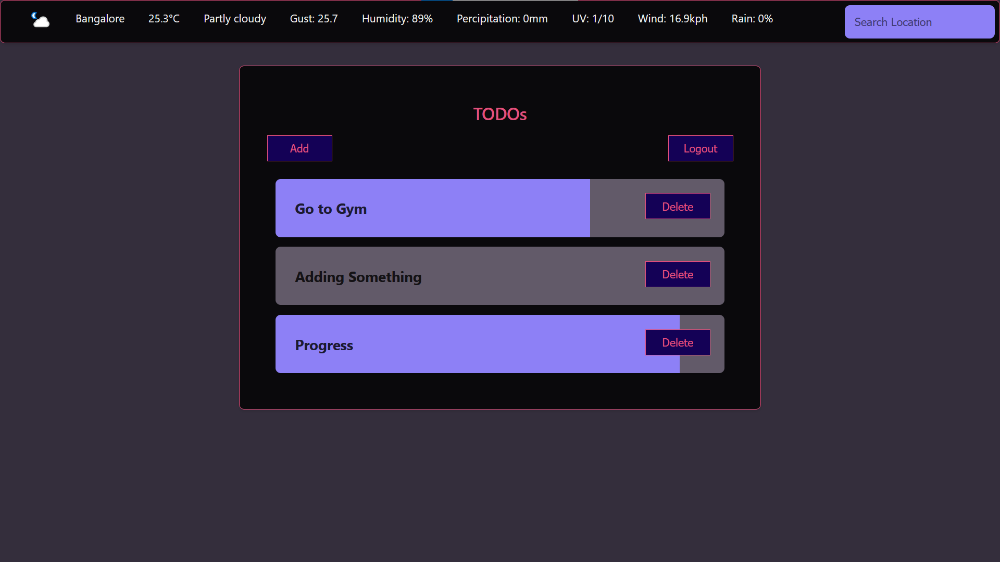

# Day Planner App


[Its extended project](https://github.com/divyanshparakh/Day-Planner)

## Pre-requisites

The following items should be installed on your machine:

✅ Docker          (Containerization)  
✅ Docker Compose  (Service Orchestration Locally)  
✅ NodeJS          (API and GUI Development)  
✅ .NET Core       (API Gateway Development)  

## Technology Stack

✅ Node JS
✅ ReactJS
✅ Express JS
❎ Ocelot
❎ GraphQL
✅ PostgreSQL

## Running Application

Run the following on the project root directory:

```sh
docker-compose up --build
```